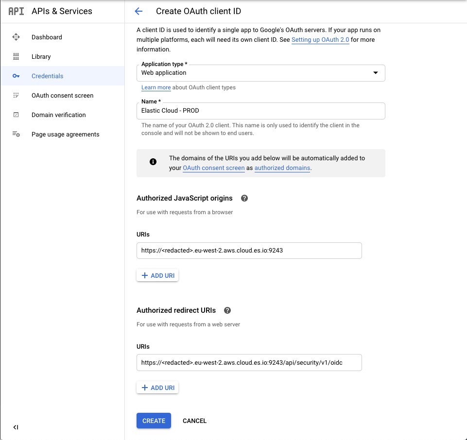
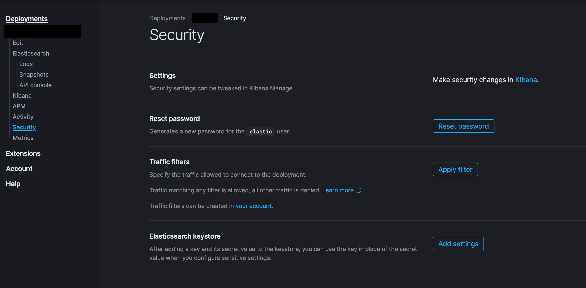
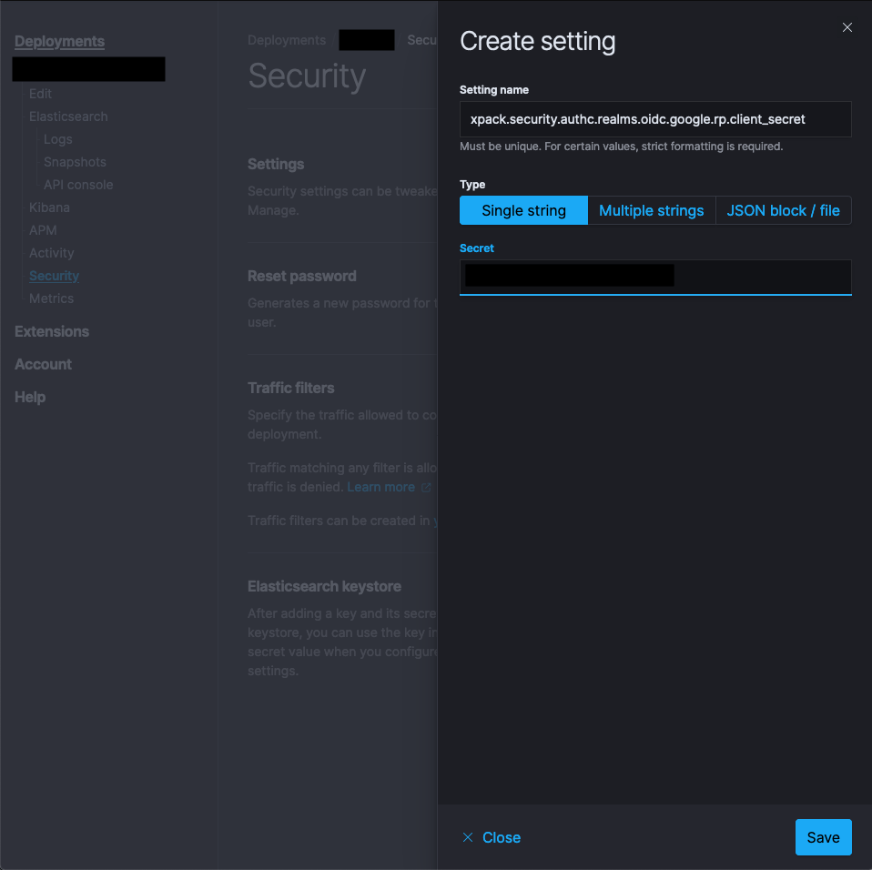
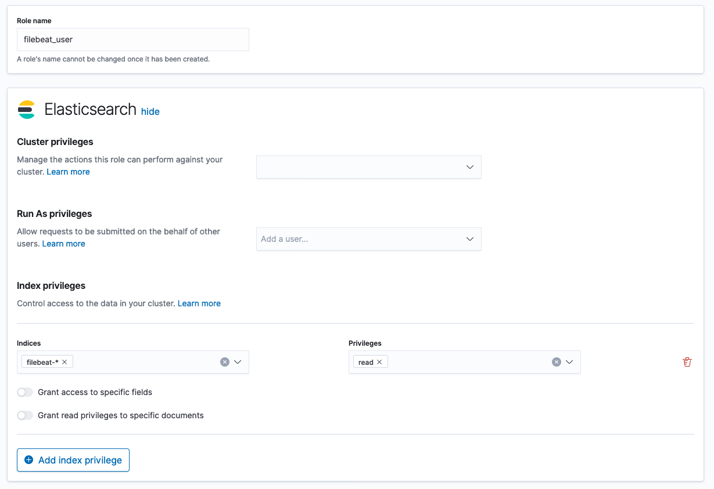
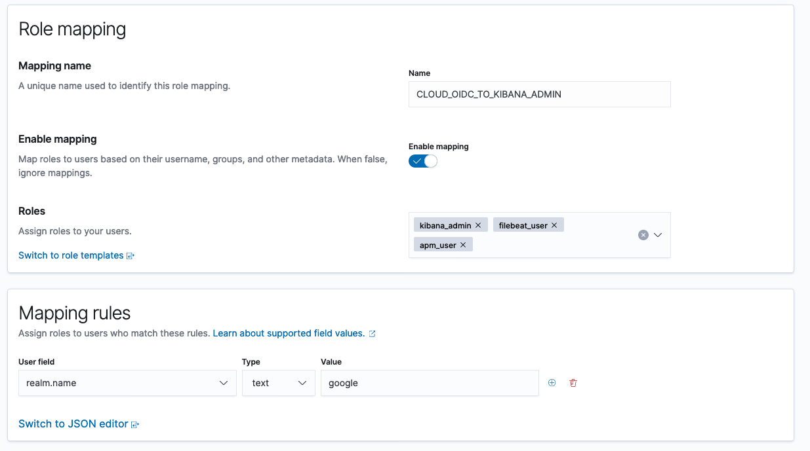

Last week, I had to add SSO layers to some of our managed monitoring stacks. While it only required some simple steps, I spent most of my time looking for the correct documentation or up-to-date examples on the internet and ended up writing this little guide. I hope it will save you some extra time !

We will add Google SSO (from G suite or Google Identity Platform) via OIDC to our Elastic Cloud instances. We'll use `google` (note the lower case) as a "connection name". Make sure you know your Kibana Endpoint, we'll need it later.

## Google Client Credentials

First, create or re-use an OAuth client ID from your Google Cloud Console. Add :

- Your Kibana Endpoint as an Authorized Javascript origin ;
- `<kibana_endpoint>/api/security/v1/oidc` as an Authorized redirect URI.



## ElasticSearch configuration

First, add the client secret as an ElasticSearch secret. Go to your deployment and use the “Security” menu entry, then add a new Elasticsearch Keystore item.



The value should be the client secret from Google.

- name : `xpack.security.authc.realms.oidc.google.rp.client_secret`
- type : `Single string`
- value : `<client_secret>`



Now, we need to configure ElasticSearch. Add this snippet in your current configuration (replace `<kibana_endpoint>` and `<client_id>` by actual values before saving!) :

```yaml
xpack.security.authc.realms.oidc:
  google:
    order: 2
    rp.client_id: "<client_id>"
    rp.response_type: "code"
    rp.redirect_uri: "<kibana_endpoint>/api/security/v1/oidc"
    op.issuer: "https://accounts.google.com"
    op.authorization_endpoint: "https://accounts.google.com/o/oauth2/v2/auth"
    op.token_endpoint: "https://oauth2.googleapis.com/token"
    op.userinfo_endpoint: "https://openidconnect.googleapis.com/v1/userinfo"
    op.jwkset_path: "https://www.googleapis.com/oauth2/v3/certs"
    claims.principal: sub
```

For reference, here is the list of available settings : https://www.elastic.co/guide/en/kibana/current/security-settings-kb.html#authentication-provider-settings.

Then, let's do the same with Kibana configuration and this snippet :

```yaml
xpack.security.authc.providers:
  oidc.oidc1:
    order: 0
    realm: google
    description: "Log in with Google"
	hint: "User your company account"
	icon: "https://lh3.googleusercontent.com/M-c5Qiy3ahxn9XnUhGqzAAM8aYYZmwiY1vvdbkoQPm6QngJcUIgyBu8Wn38JebP3WZ1uDi86m14GPFK65UZugIeMzLGRO-ZNMoLS"
  # For now, we want to keep the classic auth until we are sure everything is working. You can remove these lines later.
  basic.basic1:
    order: 1
```

Save your changes and wait for your cluster to be up and running again. The UI will tell you when everything is ready.

## Roles management

Now, we just need to make some changes to the existing roles.

First, go on your Kibana instance and head for the Stack Management menu. From here, create a new role for filebeat indices. Give this new role permissions to `read` `filebeat-*` indices. Please note that I'm assuming you are using filebeat to collect logs from your services. Just make sure this new role can read the indices where your logs data are stored.



Then, create a mapping for this new roles and your OIDC users. Choose an arbitrary name, e.g. `CLOUD_OIDC_TO_KIBANA_ADMIN`.
Make sure you include `kibana_admin`, `apm-user`and `filebeat_user`, the newly created role.



## Test it!

You should be able to log in with Google now :). Log out from Kibana and choose the new "Login With Google" option in the Login screen.

## Resources

- ElasticSearch doc : https://www.elastic.co/guide/en/elasticsearch/reference/master/oidc-guide-authentication.html
- Elastic Cloud doc : https://www.elastic.co/guide/en/cloud/current/ec-secure-clusters-oidc.html
- Google OpenID Connect doc : https://developers.google.com/identity/protocols/oauth2/openid-connect
